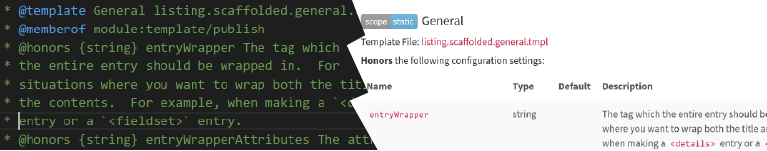

What is `shinstrap`?

[`shinstrap`](https://github.com/Shizen/shinstrap) is a WIP fork of the [`ink-docstrap`](https://github.com/docstrap/docstrap) [`jsdoc`](https://github.com/jsdoc3/jsdoc) template.  `jsdoc` allows you to comment your code following particular patterns which can then be processed (by jsdoc) to generate documentation automatically.  `docstrap` is a template designed to generate jsdoc documentation with certain features--sunlight syntax highlighting for code blocks, full text search, bootstrap styling, to name a few.  

The primary purpose of `shinstrap` is to add the ability to create and use *new* jsdoc tags to your documentation.  `shinstrap` allows you to control how you want to display new and old jsdoc comments without resorting to writing a new template.  The capabilities exposed by this template allow comments in code to document semantic relationships and meanings which go beyond the basic semantics of javascript.  You can comment tasks in Grunt, routes in Express, or as this template itself demonstrates, its own template files.  You can make new tags to document env variables and settings you honor or which impact your behavior, and these documentation fragments can even be aggregated in various ways.



You can also augment the documentation generated by this template with various display sugar like collapsible panes, icons and the like with minimal effort (I demonstrate this in brief in `shinstrap`'s own [documentation](https://shizen.github.io/shinstrap/)).  With the ability to provide your own `.tmpl` files you can create dependency charts and the like in `d3` and embed them into your documentation and so on.  The possibilities are really endless.

---

To get started, checkout the [Usage guide](https://shizen.github.io/shinstrap/tutorial-Usage.html).

---

## Installation

(! Not Yet Released on npm !)

To install `shinstrap` you can use `npm`:

	npm install --save-dev shinstrap

Remember you need `jsdoc` as well:

	npm install --save-dev jsdoc

## Requirements

This package is a `template` for [`jsdoc`](http://usejsdoc.org/index.html), and as such requires `jsdoc` in order to have a purpose.  See the [Usage guide](https://shizen.github.io/shinstrap/tutorial-Usage.html) or [jsdoc's own documentation](http://usejsdoc.org/about-configuring-jsdoc.html) for more details.

## New `templates` options

The `templates` section of your [jsdoc configuration json](http://usejsdoc.org/about-configuring-jsdoc.html) file is where template specific settings are expected to go.  `shinstrap` leverages these settings as the primary method for customizing the output of this jsdoc generator template.  See {@tutorial Usage} for more details.

`favicon`
:		If specified, will set the favicon for the generated documentation.  Because of limitations in some browsers, the specified image will be converted to a datauri and stored on (every) generated page.

`supplementalCSS`
:		Custom supplemental css file options for simple tweaks.  Can be either a string or an array to a resource path location where the `css` file(s) in question are located.  

		"supplementalCSS": [ "local.css", "node_modules/@me/my-plugin/itscss.css" ]

`supplementalJS`
:		A string or array of strings to the javascript resource files to be included on each page of the generated documentation.

`supplementalFonts`
:		A string or array of string paths for any font files to be included with the generated documentation's static files.

`templateOverrideDir`
:		Specify a directory in which to place custom documentation templates.  These can be referenced from your jsdoc configuration files in the tag descriptors specified in the `customizeOutput` section of the `templates` section.  This directory *does* override the standard templates directory, allowing one to override standard templates like `container.tmpl`.

`customizeOutput`
:		An object which allows customization of listing generation ordering and output.  `customizeOutput` is made up of three sections--

1. The `menus` section which allows for the custom specification of menus into which "tutorials" may be organized.
2. The `doclets` section which allows the specification of custom pre-processing and handling for a given doclet type.
3. Zero or more `tmpl` customization sections, allowing the specification of entry order by template specifier path, with defaults, as well as specification of custom tag display handling (again by specifier path).

! Note

This package uses evals in a few places to augment documentation generation.  It is my belief that as a developer tool used to document source code to which you clearly have access, this doesn't represent a security issue (although it could allow for some interesting mistakes).  It is possible that in certain large orgs with hard to predict separation of responsibilities and access that this could represent a problem, especially with automated documentation generation.  This should still be a manageable security issue, just treat your `.jsdoc.json` with similar precautions to the rest of your protected sources.

## Issues (poor man's version)

- That screenshot is blurry and terrible!!!
- The scoping of sections is "naive", and largely inherited from `jsdoc`'s default template.  This poorly worded issue is a reminder to myself to reconsider the section specifiers used to identify which sections of the generated documentation a set of custom output configurations applies to.  (i.e. the structure of `customizeOutput`).  See commentary on this topic in `DESIGN.md#Design Notes`.  It is not hard to imagine wanting this to be an actual semantic description which discovers its own scope from reflection on the template being rendered, but that's out of scope for the moment.
	- Any work here could also include special casing options by the access level being rendered.  For example, it could be a thing to only render `design` tags in a generation invoked with `-p`.  Of course, one could just make a separate configuration file for each documentation case, which makes more sense to me, possibly (although proliferation of files...)--e.g. `.jsdoc.internal.json` and `.jsdoc.client.json`...  Something to think about anyway.
- As with the original templates from which it was derived, there is no error handling or debugging for documentation generation per se.  This could be added as a feature.  Debugging documentation generation, especially when documenting a large project for the first time can be exceptionally time consuming for people who are not currently deeply invested in jsdoc patterns.
- The naming conventions for classes in `docstrap` is inconsistant as written.  I leave correction of this for a `shinzen` template--`shinstrap`'s output is intended to be structurally consistant with `docstrap` (including classes on elements).  These are, of course, overridable.  Similarly, these templates could probably use some re-syncing with the original `jsdoc` default templates.
- attribs in toc (e.g. the right hand side toc)
	The "issue" here, is members in the toc display attributes.  It might be desireable to have that display controlled by something.  Conversely, it might also be nice to be able to decorate other toc-heading displays with alternate information depending on type, etc.  This is a specific case of a broader question of customization of nav titles.  One might like icons, etc.  Right now, these are largely generated by "client" side javascript.
- Unit tests.  One could imagine a set of unit tests for jsdoc templates and a second, less useful set for shinstrap.  Also some unit tests for shinstrap templates specifically (`partial.scaffolded.*` and `listing.scaffolded.*`).  One could get arbitrarily "silly" by wiring in a relationship between documented `@honors` specifications with actual behavior, at least for known settings (non-template settings).  Feels pretty marginal utility to me though.
- Data specifier.  Currently there is an explicit association between the tag name and where its information lives on the `doclet` or data fragment.  This has proven to work fine in all my use cases thus far, but it's not hard to imagine a scenario where someone might wish to refer to another part of the doclet, and its not clear that the system as written can cover all these scenarios.
- "default" listing suppression--There is no *easy* way to suppress the rendering of a default listing in `shinstrap`

## Futures

- It has been brought to my attention that some people might care about webpacking js/css files and minification.  I feel like this is rather out of scope for this project, but... maybe?
- One of the primary benefits of `shinstrap` over just tweaking your templates on a per project basis is reuse.  This would be even more augmented if I created a system wherein one could inherit `customizeOutput` data.  This system is already partially in place in how I deal with `defaults.json` and the contents of `conf` (the `templates.customizeOutput` settings).  This could reasonably be expanded to work exclusively with external files in an inheritance chain allowing for gists and include patterns to say... "I want the tag formats from `shinmark` and then all the formats from `content-ars` and then all the formats I've defined locally for my project".  This seems like a good idea.
- I thought I mentioned this somewhere, but it feels extremely useful to either allow preprocessing replacement inline tags (like `{@currentVersion}`), and/or to make information available from git/`package.json` available in `jsdoc/env` or some other mechanism to the plugins.  Some of this involves chicken and egg issues, like that example (`{@currentVersion}`) only becomes derivable when a commit or a `git tag` or `npm version` is executed (`{@currentCommit}`).  This speaks to this being an issue beyond the scope of this package, per se, but rather a larger documentation ecosystem.  
- The full text search capabilities of this package could be significantly enhanced with the creation of an `sqlite` database and using its full-text search capabilities along with a "contextualizer" (I forget the sqlite name) to inform various important details of the sources for search criteria, particularly semantic information.  This doubly so because we have the doclet tree from which to build out the database.
	- A "live" or client side "cache" of the AST could prove useful for many other features, including client-side exploration of various relationships via various data visualizers.
- On the subject of data visualizers, I could include some examples thereof.  I have an `@tag` example in `shin-jsdoc-tags` which could be used to make a tag graph (if, you know, I used it).  
- This template could be extended to allow for some measure of error handling, mostly in the form of reporting unexpected input to enhance "debugging" situations where generated documentation does not live up to expectations :). 
- Add a `generateLandingPage` option, to generate a page for doclets which normally would not generate a page of their own (say you had an alternate sort of "class" or whatever).  Do a find on the doclet kind; tie into `see` mechanics to wire up links; call `generate` to generate the page.  Theoretically feasible.
	Such pages could also be used for other types of aggregators, for instance, tagging functions in a group or an "aspect", a landing page displaying modules/functions by author or design group, etc.  Or by access-group (see below).  And so on.
	- This mechanism would probably include a template handler binding for the generated doclet, but if not `container.tmpl` would want to be able to defer to another template similar to how it handles `doc.kind==="class"` atm.
- Introduce "access-scopes", for custom access grouping/displays.  One step away from TBA style tag filtering.  The idea would be to allow setting an access scope like "For Developers" or "Sites Group" or whatever, possibly as a first order entity with its own doclet and page generation, but specifically to allow tagging of other doclets for filtering when creating documentation to allow making docs for specific audiences.
- I debate introducing `useScaffolded` for `usePartial`, `usePerItemScaffolded` for `usePerItemPartial`, `usePreItemMapScaffolded` for `usePerItemMapPartial` (and any others I missed?).  `defer` does not need a `deferScaffolded` as `alternateHandler` should serve that purpose.
- Grouping and Collapsibility (wire in bootstrap's collapse pattern)
- Add a medal decorator item marshaller (so one can decorate certain items with specific medals, e.g. Deprecated or Not Implemented, Template-Helper, etc.)
	This possibly wants to be something more generic and bindable, possibly decorated in various fashions (short/brief, verbose, decorated, listing) for based on the context being displayed (e.g. in a toc, as a title, in a list, etc).
- I have commented.. somewhere on the idea of pre-processed expansions (e.g. {@CurrentVersion}).  Another fun example of a preprocessor expansion would be hitting your github/webservice to pull issues related to the entity being documented.  Internal feature requests, api expansions, etc. could be annotated and included in generated documentation based on the context for said generation.  Which reminds me to comment somewhere about the idea of targetted documentation--jsdoc provides a seldom used ability to scope the generated documentation according to programmatic scope (allowing, basically an internal and an external set of documentation).  As noted in access-groups above, there are several other scenarios and targetted documentation types you might want to be able to create, and there is no (good) reason why this system shouldn't be able to accomodate.
- Adopt a proper template plugin pattern.
- Another pet peeve is the disconnect between markdown generation and jsdoc generation, particularly in the area of links.  It would be nice if I could put in a link to say, `Usage.md` in a document which is going to go through both markdown and jsdoc and have it link to the "right" file.  Probably via a preprocessor in jsdoc.  The details are a bit complicated, having to do with targets and context and what not.  A markdown link to a file which *will* be generated (but may not be) in a reference list at the end of the markdown document, with some sort of patch processor to fixup registered markdown documents to update their references when they reference jsdoc documentation...  in situ when the file is a tutorial or README.md as its processed for use, but also external to the process for files on disks...  But which version do I want to link to, though?  The private/internally generated docs' version?  The public?  Seems problematic.  A handle-like link registry is what we want, but is out of scope for markdown.  And also you can nearly achieve the same thing through conventions.  `docs/`, `internal-docs/`, make your link and if it has been generated...  Of course also not hard to imagine more nuanced features at the point where you had a more robust system.  Meh, irritating.
- Merge in [`wicked`](https://github.com/thlorenz/wicked) type functionality, which is effectively a template itself, to allow direct exportation to github wiki format.  One could even envision extending jsdoc to have a generator plugin separate from the template, to generate marshalled output, but that might be splitting nits.
- Re-scope the documentation for older `docstrap` documentation.
- Either as part of `shinmark` or as a replacement markdown plugin, scan for some custom tag to cause `jsdoc` generation for referenced files.  Similar for link fixups (I think I referenced this somewhere).  So, for example, I could reference `.jsdoc.json` in a markdown doc and get a link to a source file generated by `jsdoc` for that file.
- This is probably the realm of `jsdoc` rather than a template, but...  Extended `package.json` derived documentation, allowing one to pick up and associate via `find`-like syntax values in `package.json`.  For instance, grabbing the `contributes.configuration` settings from a vscode extension's `package.json` or the build settings from something under `shin-grunt-build-tasks` (to decorate the README.md with, for instance).  Also added to the `data` namespace for markdown/shinmark for reference in markdown commentary.
- Create a separate `manifest` templates setting as a general clearing house for files to include as "static" files with the generated documentation as a separate logical setting from the various `supplemental*` settings.  Then add a specific set of general includes (for `<link>`s and `<script>`s which need to be added to every page).  One could even imagine creating a scoped include specification to include `css` or `js` files conditionally by scope.  For example, to add a particular `css` file only for pages listing `memberof`s a specific module (e.g. client vs. server modules, by team, render thread vs. server thread, and so on).

## Changelog

See [Changelog](CHANGELOG.md) for change history.

### About these docs

The documentation in this repos' wiki was generated using this template and jsdoc pointing at itself.  As a fork of `docstrap`, there is a host of documentation derived from that project which has not [yet] been modified, and is largely "noise" at this elevation for most users.  The primary bits to look at should be described in more detail in the {@tutorial Usage} document.  As a shorthand/fallback, however, the primary documents to look at are the {@link module:template/publish} module and the {@link module:template/publish~view} "namespace" which documents the helper functions available in scope of every template (`tmpl`) file, which are the primary renderers for templates in `jsdoc`. 

! Below is the old README for docstrap, unmodified (afaik)

Other useful "stuff" :tm: ;) --  
- [vscode `.tmpl` colorizer](https://marketplace.visualstudio.com/items?itemName=shinworks.tmplcolorizer)

---

# vvv Original DocStrap README vvv

---

# DocStrap [](http://gruntjs.com/)

DocStrap is [Bootstrap](http://twitter.github.io/bootstrap/index.html) based template for [JSDoc3](http://usejsdoc.org/).
In addition, it includes all of the themes from [Bootswatch](http://bootswatch.com/) giving you a great deal of look
and feel options for your documentation, along with a simple search. Additionally, it adds some options to the conf.json file that gives
you even more flexibility to tweak the template to your needs. It will also make your teeth whiter.

## Features ##

* Right side TOC for navigation in pages
* Integrated offline search
* Themed
* Customizable
* Syntax highlighting

### What It Looks Like ###
Here are examples of this template with the different Bootswatch themes:

+ [Cerulean](http://docstrap.github.io/docstrap/themes/cerulean)
+ [Cosmo](http://docstrap.github.io/docstrap/themes/cosmo)
+ [Cyborg](http://docstrap.github.io/docstrap/themes/cyborg)
+ [Flatly](http://docstrap.github.io/docstrap/themes/flatly)
+ [Journal](http://docstrap.github.io/docstrap/themes/journal)
+ [Lumen](http://docstrap.github.io/docstrap/themes/lumen)
+ [Paper](http://docstrap.github.io/docstrap/themes/paper)
+ [Readable](http://docstrap.github.io/docstrap/themes/readable)
+ [Sandstone](http://docstrap.github.io/docstrap/themes/sandstone)
+ [Simplex](http://docstrap.github.io/docstrap/themes/simplex)
+ [Slate](http://docstrap.github.io/docstrap/themes/slate)
+ [Spacelab](http://docstrap.github.io/docstrap/themes/spacelab)
+ [Superhero](http://docstrap.github.io/docstrap/themes/superhero)
+ [United](http://docstrap.github.io/docstrap/themes/united)
+ [Yeti](http://docstrap.github.io/docstrap/themes/yeti)

To change your theme, just change it in the `conf.json` file. See below for details.

## Ooooh, I want it! How do I get it? ##

If you manage your own version of jsdoc:

```bash
npm install ink-docstrap
```

When using [grunt](http://gruntjs.com/), please look at [grunt-jsdoc](https://github.com/krampstudio/grunt-jsdoc) which you can use with
docstrap.

### Command Line Example ###

```bash
jsdoc -c path/to/conf.json -t ./node_modules/ink-docstrap/template -R README.md -r .
```

The `-c` sets the config, and the docstrap README does talk about the options you can put in templates that docstrap is supposed to look for.

The `-t` sets the template. This is the option you need to set to get the docstrap template to be used.

The `-R` sets a markdown file to be the front page of the documentation.

The `-r` tells jsdoc to run recursively.

The `.` says from current directory.

## Configuring the template ##

DocStrap ships with a `conf.json` file in the template/ directory. It is just a regular old
[JSDoc configuration file](http://usejsdoc.org/about-configuring-jsdoc.html), but with the following new options:

```javascript
"templates": {
	"systemName"            : "{string}",
	"footer"                : "{string}",
	"copyright"             :  "{string}",
	"includeDate"           : "{boolean}",
	"navType"               : "{vertical|inline}",
	"theme"                 : "{theme}",
	"linenums"              : "{boolean}",
	"collapseSymbols"       : "{boolean}",
	"inverseNav"            : "{boolean}",
	"outputSourceFiles"     : "{boolean}" ,
	"outputSourcePath"      : "{boolean}",
	"dateFormat"            : "{string}",
	"syntaxTheme"           : "{string}",
	"sort"					: "{boolean|string}",
	"search"                : "{boolean}" 
}

```
### Options ###

*   __systemName__
	The name of the system being documented. This will appear in the page title for each page
*   __footer__
	Any markup want to appear in the footer of each page. This is not processed at all, just printed exactly as you enter it
*   __copyright__
	You can add a copyright message below the footer and above the JSDoc timestamp at the bottom of the page
*   __includeDate__
	By default, the current date is always shown in the footer of the generated documentation. You can omit the current date by setting this option to `false`
*   __navType__
	The template uses top level navigation with dropdowns for the contents of each category. On large systems these dropdowns
	can get large enough to expand beyond the page. To make the dropdowns render wider and stack the entries vertically, set this
	option to `"inline"`. Otherwise set it to `"vertical"` to make them regular stacked dropdowns.
*   __theme__
	This is the name of the them you want to use **in all lowercase**. The valid options are
	+ `cerulean`
	+ `cosmo`
	+ `cyborg`
	+ `flatly`
	+ `journal`
	+ `lumen`
	+ `paper`
	+ `readable`
	+ `sandstone`
	+ `simplex`
	+ `slate`
	+ `spacelab`
	+ `superhero`
	+ `united`
	+ `yeti`
*   __linenums__
	When true, line numbers will appear in the source code listing. If you have
	[also turned that on](http://usejsdoc.org/about-configuring-jsdoc.html).
*   __collapseSymbols__
	If your pages have a large number of symbols, it can be easy to get lost in all the text. If you turn this to `true`
	all of the symbols in the page will roll their contents up so that you just get a list of symbols that can be expanded
	and collapsed.
*   __analytics__ Add a [Google Analytics](http://www.google.com/analytics) code to the template output
 _e.g._ `"analytics":{"ua":"UA-XXXXX-XXX", "domain":"XXXX"}`
    * __ua__ The google agent (see Google Analytics help for details)
    * __domain__ The domain being served. (see Google Analytics help for details)
*   __inverseNav__
	Bootstrap navbars come in two flavors, regular and inverse where inverse is generally higher contrast. Set this to `true` to
	use the inverse header.
*   __outputSourceFiles__
	When true, the system will produce source pretty printed file listings with a link from the documentation.
*	__outputSourcePath__
	When `outputSourceFiles` is `false`, you may still want to name the file even without a link to the pretty printed output.
	Set  this to `true` when `outputSourceFiles` is `false`. `outputSourceFiles` when `true` takes precedence over this setting.
*   __dateFormat__ The date format to use when printing dates. It accepts any format string understood by [moment.js](http://momentjs.com/docs/#/displaying/format/)
*   __syntaxTheme__ String that determines the theme used for code blocks. Default value is `"default"`. It can be any value supported
    at [sunlight themes](https://github.com/tmont/sunlight/tree/master/src/themes) which right now consists of...uh...`"default"` and `"dark"`,
    but at least you have it if you need it.
*  __sort__ Defaults to true. Specifies whether jsdoc should sort data or use file order. Can also be a string and if so it is passed to jsdoc directly. The default string is `"longname, version, since"`.
*  __search__ By default, the template includes a quick search box. For large APIs, the search database can be too expensive to load. If needed you can disable this feature setting this option to false. 

## Syntax Highlighting ##

### Language ###

The default language will be JavaScript, but there are a couple of ways to secify the language.

DocStrap support the language specified in the standard way e.g.

```
```html
<html></html>
```

DocStrap also introduces a new documentation tag which can appear inside any example block in source code,
or in any fenced code block in markdown: `{@lang languageName}`, where
_`language`_ can be any of the languages supported by [Sunlight](http://sunlightjs.com/)

When in a doclet, add the tag just after the `@example` tag like this:

`@example {@lang xml}`
`<div>This is the most interesting web site ever</div>`

These are the supported languages.

* ActionScript
* bash
* C/C++
* C♯
* CSS
* Diff
* DOS batch
* Erlang
* Haskell
* httpd (Apache)
* Java
* JavaScript
* Lisp
* Lua
* MySQL
* nginx
* Objective-C
* Perl
* PHP
* PowerShell
* Python
* Ruby
* Scala
* T-SQL
* VB.NET
* XML (HTML)

### Example Caption ###

If you want a caption to your example, add it in a HTML caption before your example e.g.

```
@example <caption>my caption</caption>
{@lang xml}
<mycode></mycode>
```

## Customizing DocStrap ##
No template can meet every need and customizing templates is a favorite pastime of....well, no-one, but you may need to anyway.
First make sure you have [bower](https://github.com/bower/bower) and [grunt-cli](https://github.com/gruntjs/grunt-cli) installed.
Fetch the source using `git` or grab the [zip file from github.](https://github.com/docstrap/docstrap/archive/master.zip) and unzip
it somewhere. Everything that follows happens in the unzip directory.

Next, prepare the environment:

    bower install

and

    npm install

When that is done, you have all of the tools to start modifying the template. The template, like Bootstrap, uses [less](http://lesscss.org/).
The way it works is that `./styles/main.less` pulls in the bootstrap files uncompiled so that you have access to all of bootstraps mixins, colors,
etc, that you would want. There are two more files in that directory, `variables.less`, `bootswatch.less`. These are the
theme files and you can modify them, but keep in mind that if you apply a new theme (see below) those files will be overwritten. It is best
to keep your changes to the `main.less` file.

To compile your changes to `main.less` and any other files it loads up,

	grunt less

The output is will be put in `./template/static/styles/site.<theme-name>.css`. The next time you create your documentation, it
will have the new css file included.

To apply a different template to the `styles` directory to modify, open up the `conf.json` in the template directory and
change the `theme` option to the theme you want. Then

	grunt apply

And the new theme will be in `variables.less`, `bootswatch.less`. Don't forget to compile your changes using `grunt apply` to
get that change into the template.

**NOTE** that these steps are not necessary to just change the theme, this is only to modify the theme. If all you want to do is
change the theme, just update conf.json with the new theme and build your docs!

## Contributing ##
Yes! Contribute! Test! Share your ideas! Report Bugs!

### Contributers ###

*Huge* thanks to all contributors. If your name should be here, but isn't, please let us know

* [marklagendijk](https://github.com/marklagendijk)
* [michaelward82](https://github.com/michaelward82)
* [kaustavdm](https://github.com/kaustavdm)
* [vmeurisse](https://github.com/vmeurisse)
* [bmathern](https://github.com/bmathern)
* [jrkim123us](https://github.com/jrkim123us)
* [shawke](https://github.com/shawke)
* [mar10](https://github.com/mar10)
* [mwcz](https://github.com/mwcz)
* [pocesar](https://github.com/pocesar)
* [hyperandroid](https://github.com/hyperandroid)
* [vmadman](https://github.com/vmadman)
* [whitelynx](https://github.com/whitelynx)
* [tswaters](https://github.com/tswaters)
* [lukeapage](https://github.com/lukeapage)
* [rcosnita](https://github.com/rcosnita)


## History ##

## 1.3.0 ##

 * Update dependencies and update CSS
 * Fixed TOC labels for members
 * Apply code highlighting to code blocks in markdown
 * Added an option to disable search

## 1.2.1 ##

 * Update lunr dependency used for searching

## 1.2.0 ##

 * Add square brackets around optional parameters
 * new option disablePackagePath option which if true makes docstrap not append the package and version to the out path
 * allow version to be missing in package.json

## 1.1.4 ##

 * Remove the unreadable orange on pre/code tags and use a dark red. Remove white background as is readable on black or white.

## 1.1.3 ##

 * Get sort option from navOptions as per docs
 * tweaks from bootswatch

## 1.1.2 ##

 * Allow example captions to contain markdown if configured in the markdown config `includeTags` section.
 * Fixes full path used as source URL for projects with one source file
 * Allow users to update the default template layout file

## 1.1.1 ##

 * Bootswatch update
 * Add viewport meta tag to html for better mobile experience

## 1.1.0 ##

 * Added includeDate option

## 1.0.5 ##

 * Navigation to anchor links now works in IE (with some flicker)
 * links to other pages now work (with some flicker in some browsers)

## 1.0.4 ##

 * Search results no longer erroneously included in side navbar
 * Tutorials now get page titles consistent with everything else
 * Improvements to the highlighted nav heading

## 1.0.3 ##

 * Drop-down shows a scrollbar when too big (regression in 1.0.1)

## 1.0.2 ##

 * Support older jsdoc by not looking in "interfaces"

## 1.0.1 ##

 * Tweak side nav and dropdowns to be the bootswatch style
 * Make the documentation responsive

## 1.0.0 ##

 * Bump to follow semver (initial development is well and truly over)
 * Corrected list of themes
 * Added Search
 * Remove highlightTutorialCode option - it didnt work

## 0.5.4 ##

 * Fix layout glitch on hte bottom of code samples
 * Support for specifying the language for fenced code blocks in the normal way
 * Fix the active item in some themes, which was missing a background
 * Tables get marked as tables
 * Dependency updates

## 0.5.3 ##

 * Removed duplicate headers
 * Remove "Index" header
 * re-fixed navigation
 * removed some dubious features (now pr's that can be re-added with a little polishing)

## 0.5.2 ##
Major update__. Amazing help from [tswaters](https://github.com/tswaters) to solve a bunch of little problems and a to bring the codebase up to Bootstrap3.
Make sure you are running the latest version of JSDoc before using this build.

Again huge, huge thanks to [tswaters](https://github.com/tswaters). Make sure you send him thanks or a tip!!!!!

### v0.4.15 ###
* PR Issue #76
* PR Issue #77

### v0.4.14 ###
* Issue #69

### v0.4.13 ###
* Issue #68

### v0.4.11 ###
* Pull Request #59

### v0.4.8 ###
* Issue #58

### v0.4.7 ###
* Issue #57

### v0.4.5 ###
* Issue #55
* Issue #54
* Issue #52
* Issue #51
* Issue #50
* Issue #45
* Issue #44

### v0.4.3 ###
* Issue #46
* Issue #46
* Issue #47

### v0.4.1-1###
* Issue #44
* Update documentation
* Issue #43
* Issue #42
* Issue #34

### v0.4.0 ###
* Issue #41
* Issue #40
* Issue #39
* Issue #36
* Issue #32

### v0.3.0 ###
* Fixed navigation at page top
* Adds -d switch to example jsdoc command.
* Fixed typo in readme
* Improve search box positioning and styles
* Add dynamic quick search in TOC
* Fix for line numbers styling issue

### v0.2.0 ###

* Added jump to source linenumers - still a problem scrolling with fixed header
* changed syntax highlighter to [sunlight](http://sunlightjs.com/)
* Modify incoming bootswatch files to make font calls without protocol.

### v0.1.0 ###
Initial release


## Notices ##
If you like DocStrap, be sure and check out these excellent projects and support them!

[JSDoc3 is licensed under the Apache License](https://github.com/jsdoc3/jsdoc/blob/master/LICENSE.md)

[So is Bootstrap](https://github.com/twitter/bootstrap/blob/master/LICENSE)

[And Bootswatch](https://github.com/thomaspark/bootswatch/blob/gh-pages/LICENSE)

[TOC is licensed under MIT](https://github.com/jgallen23/toc/blob/master/LICENSE)

[Grunt is also MIT](https://github.com/gruntjs/grunt-cli/blob/master/LICENSE-MIT)

DocStrap [is licensed under the MIT license.](https://github.com/docstrap/docstrap/blob/master/LICENSE.md)

[Sunlight uses the WTFPL](http://sunlightjs.com/)

## License ##
DocStrap Copyright (c) 2012-2015 Terry Weiss & Contributors. All rights reserved.

Permission is hereby granted, free of charge, to any person
obtaining a copy of this software and associated documentation
files (the "Software"), to deal in the Software without
restriction, including without limitation the rights to use,
copy, modify, merge, publish, distribute, sublicense, and/or sell
copies of the Software, and to permit persons to whom the
Software is furnished to do so, subject to the following
conditions:

The above copyright notice and this permission notice shall be
included in all copies or substantial portions of the Software.

THE SOFTWARE IS PROVIDED "AS IS", WITHOUT WARRANTY OF ANY KIND,
EXPRESS OR IMPLIED, INCLUDING BUT NOT LIMITED TO THE WARRANTIES
OF MERCHANTABILITY, FITNESS FOR A PARTICULAR PURPOSE AND
NONINFRINGEMENT. IN NO EVENT SHALL THE AUTHORS OR COPYRIGHT
HOLDERS BE LIABLE FOR ANY CLAIM, DAMAGES OR OTHER LIABILITY,
WHETHER IN AN ACTION OF CONTRACT, TORT OR OTHERWISE, ARISING
FROM, OUT OF OR IN CONNECTION WITH THE SOFTWARE OR THE USE OR
OTHER DEALINGS IN THE SOFTWARE.
